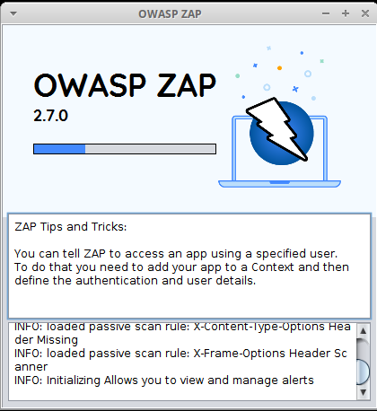
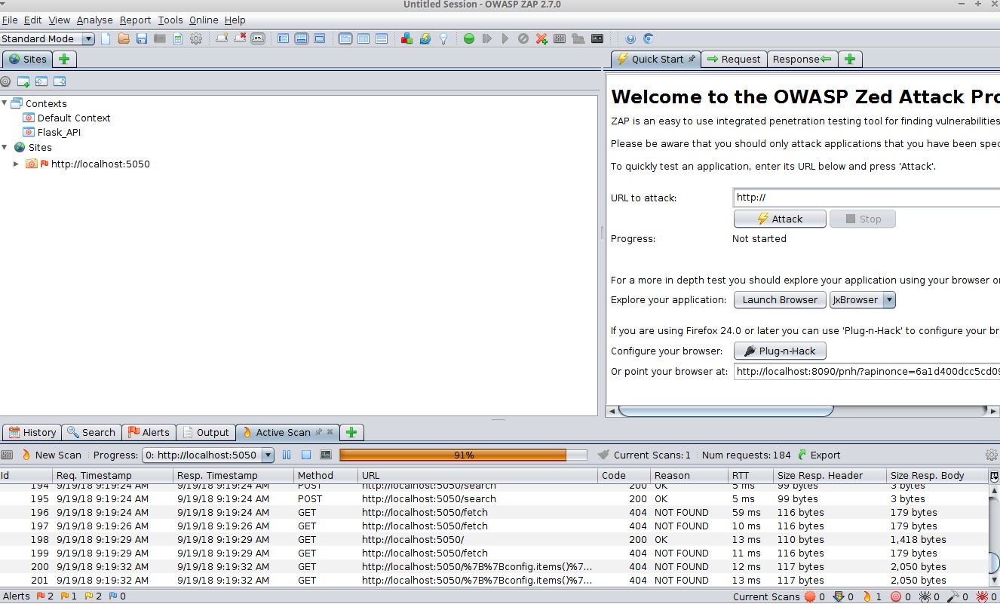
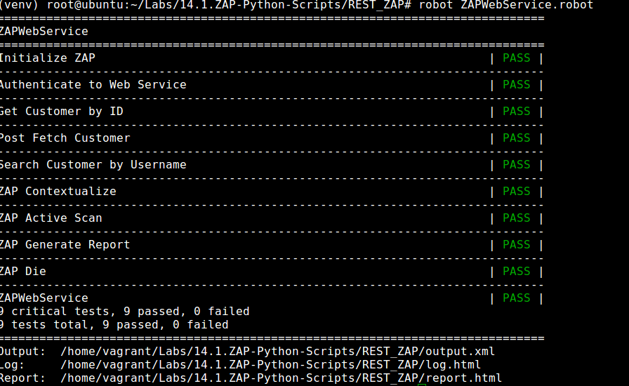

## RestZap
* Step 1: Open terminal
* Step 2: Change directory

	 `cd /home/vagrant/Labs/14.1.ZAP-Python-Scripts/REST_ZAP`
	 
* Step 3: Activate virtualenv
	
	`source venv/bin/activate`	
	
* Step 4: Start vulnerable flask app

	`start-vul-flask`
	
* Step 5:	Run robot scan

	`robot ZAPWebService.robot`
	
* Step 6: ZAP opens on a new window
	
	
    
* Step 7: ZAP status of the scan will look like this
	
	
	
* Step 8: In the `Alerts` section we can see the custom script `Jinja Flaw` 
	
		
	
* Step 9: Once the scan is done the command line will have the following status screen

	
	
* Step 10: Deactivate virtualenv

	`deactivate`
	
* Step 11: Stop flask app 

	`clean-doc`
			
	
	
	

