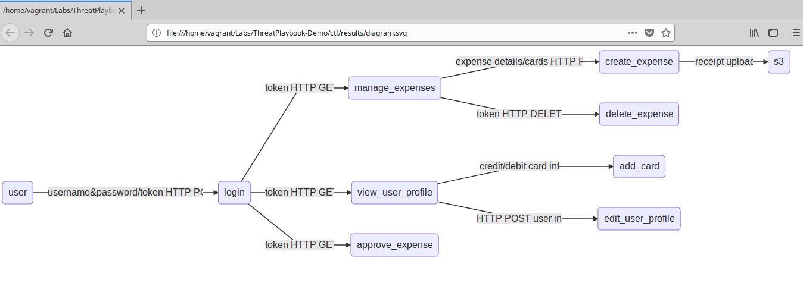

## ThreatPlayBook
* Step 1: Open terminal

* Step 2: Change directory

	 `cd /home/vagrant/Labs/ThreatPlaybook-Demo`
* Step 3: Activate virtualenv
	
	`source venv/bin/activate`	
	
* Step 4:	Change Directory to scripts directory

	` cd /home/vagrant/Labs/ThreatPlaybook-Demo/ctf`
	
* Step 5: Start the node application 
	
	`docker-compose up -d`
    
* Step 6: Run robot script
	
	`robot SecurityTest.robot`
	
* Step 7: Once the scan is done your folder structure will look like this
	
	

* Step 7a: Open the report with the following command: 
	
	`cd results/`
	`grip Report.md`

	Open another Terminal and type: `firefox http://localhost:6419`
	
* Step 8: Open the report using firefox

	`firefox $PWD/results/diagram.svg`
	
* Step 9: Results would look like this

	
	
* Step 10: The threat model diagrams will be in the `results/threat_maps` folder
	
	
	
	You can view them by issuing the following commands
	
	`firefox $PWD/results/threat_maps/approve_expense.png`
	
	`firefox $PWD/results/threat_maps/login_user.png`
	
	`firefox $PWD/results/threat_maps/manage_expenses.png`
	

* Step 11: Deactivate virtualenv
	
	`deactivate`
	
* Step 12: Stop the node js app
	
	`docker-compose down`			
	

